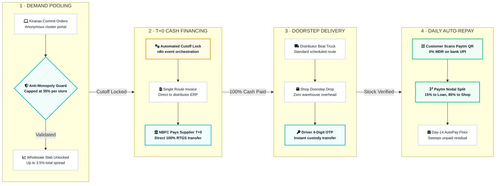

# 🚀 B2Beat
**Event-Driven Beat Aggregation & Automated Channel-Credit Orchestrator**

**B2Beat** is an asset-light middleware protocol that digitizes FMCG distributor delivery beats. It aggregates fragmented neighborhood retail (kirana) demand to unlock real wholesale Cash Discounts (2.5%) via instant T+0 NBFC financing, executing deliveries on existing distributor routes, and automating micro-repayments via counter UPI QR splits.

---

## 🛑 The Problem: The Cash-Discount Trap
1. **The 2.5% Penalty:** Distributors offer a 2.5% Cash Discount for instant payment. Cash-strapped kiranas buy on 21-day credit, losing ₹1,20,000+ in profit yearly.
2. **Fragmented Purchasing:** Small order sizes (e.g., 5 bags of sugar) never unlock distributor wholesale volume slabs.
3. **Working-Capital Freeze:** Distributors chase payments for 25+ days (DSO), locking up capital and risking bad debts.

## ⚡ The B2Beat Solution
1. **Virtual Beat Pooling:** 12–20 kiranas anonymously pool staple orders along scheduled delivery routes to unlock volume pricing.
2. **Instant T+0 Financing:** Partner NBFC pays the distributor 100% upfront on Day 0 (closed-loop channel financing).
3. **Doorstep Beat Delivery:** Invoiced goods arrive at the kirana counter on the distributor's regular truck; driver OTP transfers custody.
4. **Dual-Rail Repayment:** Automated daily micro-sweeps (15-20%) from Paytm QR counter sales, backstopped by a Day-14 UPI AutoPay floor.

---

## 🏗️ System Architecture & Data Flow

